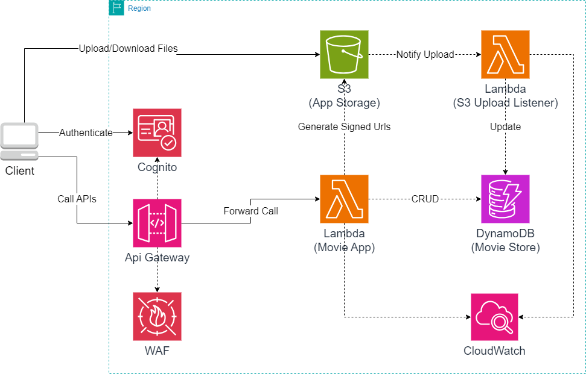

# A Complete Cost Effective Serverless Application on AWS

This project utilizes Quarkus, a Kubernetes-native Java framework, combined with AWS Lambda, enabling seamless deployment and scaling of serverless applications in the AWS cloud environment.
By leveraging AWS Lambda, this serverless architecture ensures high availability, scalability, and cost-efficiency, making it an ideal solution for modern cloud-native applications.

The primary focus of this project is to serve as a Proof of Concept (POC) movie store application. It is designed to manage movie data, including information such as title, actors, and cover files.  

Additionally, the project includes a Python-based Lambda function responsible for updating the database (DynamoDB) after a file, such as a movie cover, is uploaded to S3. This Lambda function ensures smooth synchronization between the uploaded files and the movie data stored in the database. Furthermore, it performs validation tasks, such as checking file sizes, to maintain data integrity within the application.

## Prerequisites
Before diving into the project, ensure you have the following prerequisites installed on your development environment:

- IntelliJ IDEA
- Quarkus official extensions
- Visual Studio (required for compilation libraries, Windows only)
- Docker (required for compilation)
- GraalVM JDK (at least version 17)
- Python 3.11
- AWS cloud account
- Postman (for testing purposes)

The application is designed can to be imported into IntelliJ IDEA that gives the possibility to install Quarkus official extensions, providing a smooth development experience.

## Compilation and lambda packaging

To compile the application using GraalVM, you'll need to install the Quarkus CLI. Follow the official [guide](https://quarkus.io/guides/cli-tooling) for installation instructions. We recommend using Chocolatey for a seamless installation process.

After you install quarkus cli you follow these steps:

- Ensure that Docker is running on your system.
- Open a terminal.
- Navigate to the root directory of the project (folder it.palex.demo-lambda).
- Execute the following command:
    ```powershell
    quarkus build --native --no-tests -Dquarkus.native.container-build=true
    ```
The compilation process typically takes around 10 minutes, depending on your hardware specifications.

Upon completion of the compilation process, a file named `function.zip` will be generated in the `target` folder. This `function.zip` file serves as a Lambda package compatible with the proxy support of the AWS API Gateway.  

### Packaging the Python S3 Lambda Notification Listener

To package the S3 notification Lambda listener written in Python, follow these steps:
- Navigate to the directory containing the Python Lambda listener project (it.palex.s3-upload-file-listener).
- Create a zip file that includes all the files present in the project directory Excluding the event-example.json file from the zip package. This file is provided for debugging purposes when running the function locally and is not required for deployment to AWS Lambda.

## Project Structure
This project follows a multi-module architecture, consisting of two primary components:
- Quarkus Movie Application (Java):
    - This module serves as the Proof of Concept (POC) movie application developed with Quarkus using Java.
    - It handles functionalities related to managing movie data within the application.

- Notification Manager (Python Lambda):
    - This module focuses on managing S3 notifications about file upload and is implemented in Python.
    - The Lambda function, written in Python 3.11, is responsible for updating the database (DynamoDB) after a file is uploaded to S3.
    - The Lambda function is triggered by S3 upload events and performs tasks such as checking the uploaded file and deleting it if necessary (e.g., if it exceeds a certain size limit). If the file is ok will be moved in a sanitezed files path and updating the database.

## AWS Services Used

After successfully building the application, you can deploy it on AWS using the provided CloudFormation template. The template sets up the following AWS services:

- **AWS Lambda**: One for the main application logic and another for the S3 notification listener.
- **AWS Cognito**: For user authentication and authorization (client_credentials flow is used).
- **AWS WAF ACLs**: To manage web application firewall rules.
- **DynamoDB**: A NoSQL database for storing application data.
- **API Gateway**: For creating and managing APIs.
- **CloudWatch**: For monitoring application logs and metrics.
- **X-Ray**: For tracing and debugging distributed applications.

### App AWS Architecture




## AWS Deployment

To deploy the application on AWS you need to:
- create an aws bucket to upload lambda code;
- package the two application in two different function.zip files;

Ensure you have AWS CLI configured with appropriate credentials.  
Run the provided CloudFormation template using your preferred deployment method.

If you are using Windows with powershell installed you can use the following script to deploy the app \(replace the placeholders with the correct values):
- `$AppName` is the name of the App;
- `$Region` is the aws region you want to deploy the application for example `eu-central-1`;
- `$BaseBucketName` base bucket name for example `movie-storage`. Is called `base` because the powershell generate 5 random letters that are appended to this name to avois collisions with the name of other S3 buckets globally;
- `Profile` is the aws profile stored in your machine;
- `$DeployBucket` the name of the bucket that will be used to deploy ;
- `$FunctionZipFile` the path to zip function file of quarkus app;
- `$UploadListenerFunctionZipFile`  the path to zip function file of python s3 listener app;
- `$allowedSourceIps` a list of ip addressed that are enabled to call this function. Have to be used the subnet notation `ip/subnet` for example `10.0.0.0/32`;
- `$customDomainAppName` custom domain of cognito (be sure to use a unique name or the deploy will fail);

```powershell
param(
    [string]$AppName = "MoviesApp",
    [string]$Region = "[REGION_WHERE_YOU_WANT_TO_DEPLOY_APP -  ex. eu-central-1]",
    [string]$BaseBucketName = "[THE NAME OF THE BUCKER ex. movie-storage]",
    [string]$Profile = "[YOUR AWS PROFILE]",
    [string]$DeployBucket = "[NAME OF THE BUCKET TO BE USED TO TEMPORRILY UPLOAD ZIP LAMBDA FILES]",
    [string]$FunctionZipFile = "./it.palex.demo-lambda/target/function.zip",
    [string]$UploadListenerFunctionZipFile = "./it.palex.s3-upload-file-listener/function.zip",
    [string]$LambdaS3UploadImageListeneZipFile = "./it.palex.s3-upload-file-listener/function.zip",
    [string]$allowedSourceIps = "[IP CSV WITH SUBNET SPECIFICATION - ex. 10.0.0.1/32;10.0.0.0/32",
    [string]$customDomainAppName = "movie-app-poc"
)

# Define the path to the CloudFormation template file
$templateFilePath = "templateAws.yaml"

$StackName = "${AppName}Stack"

# append 5 random letter to try to have a unique bucket name
$RandomString = -join (1..5 | ForEach-Object { [char]((Get-Random -Minimum 97 -Maximum 123)) })
$BucketName = "${BaseBucketName}-${RandomString}"


$bucketExists = aws s3api head-bucket --bucket $DeployBucket --region $Region --profile $Profile 2>&1 | Select-String -Pattern "404"

if (![string]::IsNullOrEmpty("$bucketExists")) {
    Write-Host "Bucket deploy $DeployBucket does not exist! please create one using for example >>> aws s3api create-bucket --bucket $DeployBucket --region $Region --profile $Profile --create-bucket-configuration LocationConstraint=$Region"
    exit 1
}

# Define the file path string
$filePath = "./target/function.zip"

# Extract the file name from the string
$fileName = [System.IO.Path]::GetFileName($filePath)

# Check if the file name ends with ".zip"
if ( !($FunctionZipFile.EndsWith(".zip")) ) {
    Write-Host "File $FunctionZipFile is not a ZIP file."
    exit 1
}

$UploadFolder="movie-app"

# Upload the function.zip file to the bucket
Write-Host "Uploading $filePath to bucket $DeployBucket..."
aws s3 cp $FunctionZipFile s3://$DeployBucket/$UploadFolder/ --region $Region --profile $Profile

$LambdaPackageFileKey="$UploadFolder/$fileName"
Write-Host "Uploaded $FunctionZipFile in bucket $DeployBucket, file key: $LambdaPackageFileKey"


$fileNameUploadImageListeneZipFile = "upload-listener-s3.zip"

# Upload the function.zip file to the bucket
Write-Host "Uploading $filePath to bucket $DeployBucket..."
aws s3 cp $LambdaS3UploadImageListeneZipFile s3://$DeployBucket/$UploadFolder/$fileNameUploadImageListeneZipFile --region $Region --profile $Profile

$LambdaUploadImageListenePackageFileKey="$UploadFolder/$fileNameUploadImageListeneZipFile"
Write-Host "Uploaded $LambdaS3UploadImageListeneZipFile in bucket $DeployBucket, file key: $LambdaUploadImageListenePackageFileKey"


# Execute the command to create the stack
Write-Host "Creating CloudFormation stack..."
aws cloudformation create-stack --stack-name $StackName `
--template-body file://$templateFilePath `
--region $Region `
--profile $Profile `
 --capabilities CAPABILITY_NAMED_IAM `
--parameters ParameterKey=AppName,ParameterValue=$AppName ParameterKey=BucketName,ParameterValue=$BucketName `
             ParameterKey=LambdaPackageBucketName,ParameterValue=$DeployBucket ParameterKey=LambdaPackageFileKey,ParameterValue=$LambdaPackageFileKey `
             ParameterKey=AllowedSourceIps,ParameterValue="$allowedSourceIps" ParameterKey=LambdaS3UploadImageListenePackageFileKey,ParameterValue="$LambdaUploadImageListenePackageFileKey" `
             ParameterKey=CustomCognitoDomainAppName,ParameterValue="$customDomainAppName"


# Execute the command to wait for stack creation to complete
Write-Host "Waiting for stack creation to complete..."
aws cloudformation wait stack-create-complete --stack-name $StackName --region $Region --profile $Profile

Write-Host "Stack creation complete."

```

## How to use the Postman Collection to call APIs

Within the repository, you'll find a Postman collection designed for utilizing the API. This collection can be utilized once deployment is finalized. Before proceeding, follow these steps:
- import the collection in your postman app;
- open the collection parameter and fill the values:
    - **BASE_URL**: Specify the URL of the deployed service (obtainable from AWS API Gateway post-deployment).
    - **LAST_ADDED_MOVIE_TITLE**: Leave this field blank; it serves as a placeholder parameter within the collection.
    - **LAST_ADDED_MOVIE_ID**: Leave this field blank; it serves as a placeholder parameter within the collection.
    - **AWS_UPLOAD_PRESIGNED_URL**: Leave this field blank; it serves as a placeholder parameter within the collection.
    - **AWS_DOWNLOAD_PRESIGNED_URL**: Leave this field blank; it serves as a placeholder parameter within the collection.
    - **COGNITO_POOL_URL**: Populate this field with the URL of the created Cognito user pool, obtainable from the AWS Cognito console.
    - **CLIENT_ID**: Populate this field with the client ID of the Cognito app client, obtainable from the app client section within the Cognito user pool details.
    - **CLIENT_SECRET**: Populate this field with the client secret of the Cognito app client, obtainable from the app client section within the Cognito user pool details.
    - **ACCESS_TOKEN**: Leave this field blank; it serves as a placeholder parameter within the collection.

## Contributing
We welcome contributions from the community! If you would like to contribute to this project, please follow these guidelines:

Submit bug reports or feature requests by opening an issue on the project's GitHub repository.
Fork the repository, make your changes, and submit a pull request for review.
Follow coding standards and maintain clean code.
Set up your development environment by following the instructions in the README.

## License
This project is licensed under the GNU General Public License v3.0 (GPLv3). See the LICENSE file for details.

## Credits

We acknowledge and appreciate the following third-party libraries and resources used in this project:
- Quarkus
- Docker
- GraalVM

## Contact
For any questions, feedback, or inquiries, feel free to reach out to us:

Email: alessandro.a.pagliaro@gmail.com  
GitHub: [My Profile](https://github.com/paaxel/)
